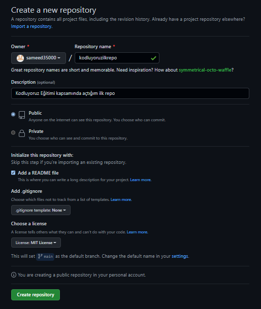

# Kodluyoruz İlk Repo

Kodluyoruz Eğitimi kapsamında açtığım ilk repo

Bu repo [Kodluyoruz](https://kodluyoruz.org/) Front-End Eğitiminde oluşturduğumuz ilk repo. İçerisinde bir adet README dosyası, bir adet de index.html barındırıyor.

  


  

## Installation
```git
git clone https://github.com/sameed35000/kodluyoruzilkrepo.git
```


  

## Usage

Projeyi cloneladıktan sonra Visual Studio Code programında açınız.


Linux için:

```Linux

cd kodluyoruzilkrepo

code.

```

## Contributing
Pull requestler kabul edilir. Büyük değişiklikler için, lütfen önce neyi değiştirmek istediğinizi tartışmak için bir konu açınız.

## License

[MIT](https://choosealicense.com/licenses/mit/)